<div align="center">

# 🌱 KisanSathi

### *Har kisan ka saccha sathi.*

**An ultra-premium, AI-powered Agritech SaaS platform** bridging the gap between advanced agricultural science and everyday farming — offering instant crop disease diagnosis, dynamic fertilizer recommendations, and an intelligent voice-enabled AI assistant.

[](https://kisan-sathi-app-kappa.vercel.app/)
[](https://kisan-sathi-app-0lvb.onrender.com/)


</div>

---

## 📋 Table of Contents

- [About](#-about)
- [Live Demo](#-live-demo)
- [Screenshots](#-screenshots)
- [Features](#-features)
- [Technology Stack](#️-technology-stack)
- [System Architecture](#️-system-architecture)
- [Project Structure](#-project-structure)
- [Setup & Installation](#-setup--installation)
- [Environment Variables](#-environment-variables)
- [API Endpoints](#-api-endpoints)
- [Machine Learning Models](#-machine-learning-models)
- [Roadmap](#️-roadmap)
- [Known Limitations](#-known-limitations)
- [Contributing](#-contributing)
- [License](#-license)

---

## 📖 About

**KisanSathi** is a full-stack Agritech platform built to put AI-powered crop intelligence directly into the hands of farmers. Instead of relying on guesswork or delayed expert visits, farmers get **instant, data-backed answers** — from diagnosing a diseased leaf photo in seconds to calculating the exact kilograms of fertilizer their soil needs.

The platform combines **computer vision**, **classical ML**, and **generative AI** into a single, elegant interface — designed to feel less like a government portal and more like a premium consumer product.

> Built as a demonstration of end-to-end AI product engineering: model training → API design → production deployment → polished UX.

---

## 🔗 Live Demo

| Layer | URL | Status |
|---|---|---|
| 🌐 **Frontend** | [kisan-sathi-app-kappa.vercel.app](https://kisan-sathi-app-kappa.vercel.app/) | Deployed on Vercel |
| ⚙️ **Backend API** | [kisan-sathi-app-0lvb.onrender.com](https://kisan-sathi-app-0lvb.onrender.com/) | Deployed on Render |

> ⚠️ **Cold Start Notice:** The backend runs on Render's free tier, which spins down after periods of inactivity. If AI features (disease detection, fertilizer calculator, or chatbot) feel unresponsive on first load, wait **30–60 seconds** for the server to spin back up and try again.

---

## 📸 Screenshots

<div align="center">

### Website Hero Section
*Modern agro-ecological hero with glassmorphism navbar and brand identity.*
<br/>
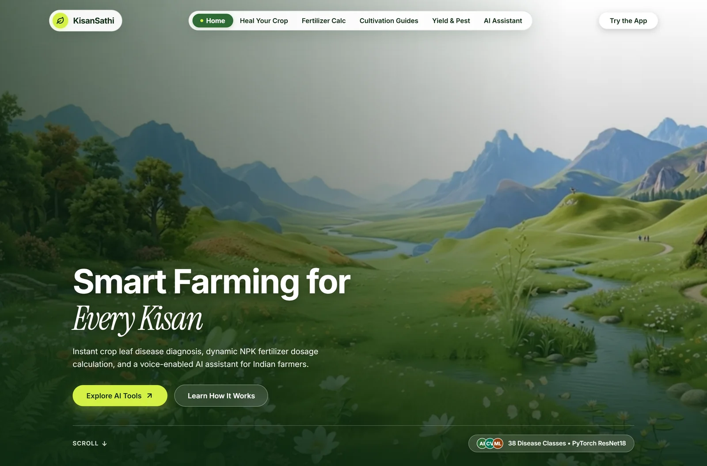

<br/><br/>

### Core Capabilities & Features
*Interactive capability accordion highlighting disease diagnosis, NPK calculations, and yield forecasting.*
<br/>
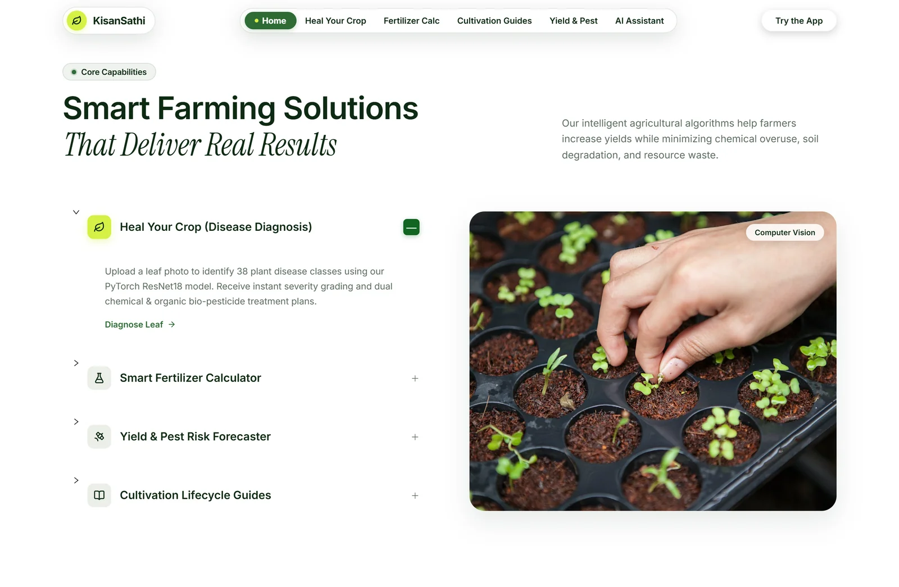

<br/><br/>

### Interactive Workflow — From Field to Forecast
*Tabbed workflow system with floating microclimate and AI model telemetry cards.*
<br/>
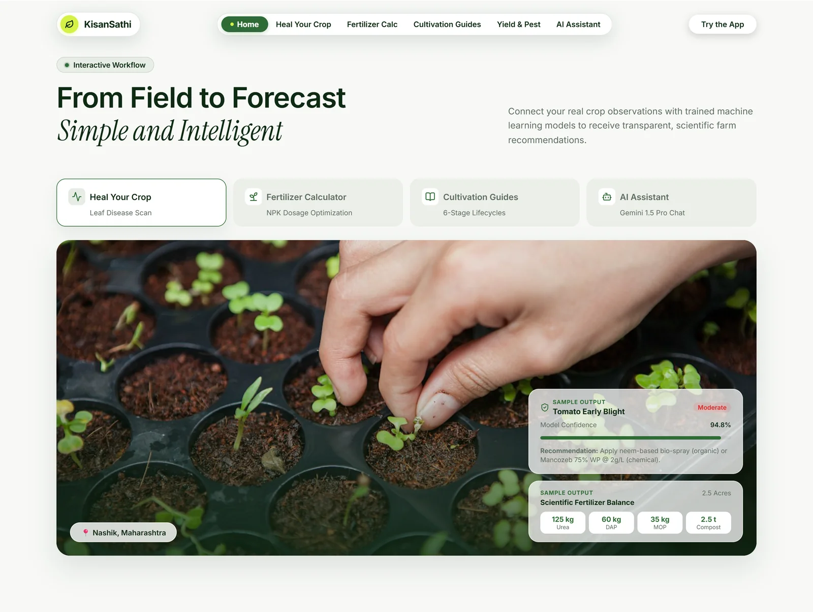

<br/><br/>

### AI Diagnosis in Action (Heal Your Crop)
*Initial leaf upload dropzone and real-time PyTorch ResNet18 diagnosis with dual chemical and organic treatment plans.*
<br/>
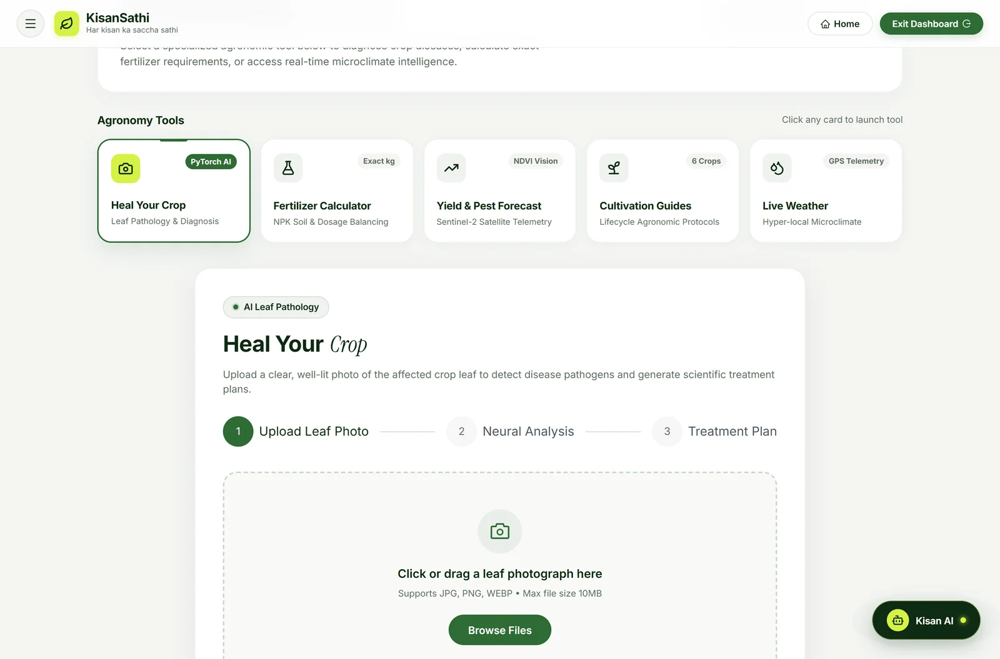
<br/><br/>
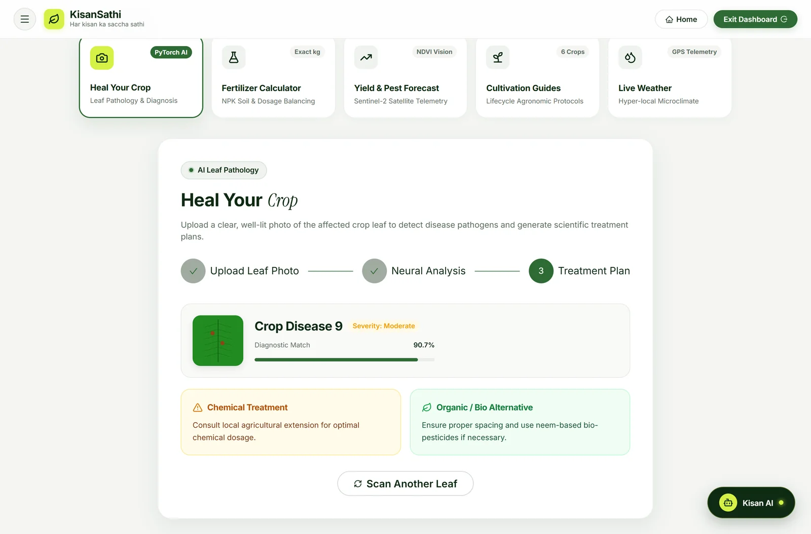

<br/><br/>

### Smart Fertilizer Calculator
*Precision soil chemistry parameters and dynamic NPK dosage balancing.*
<br/>
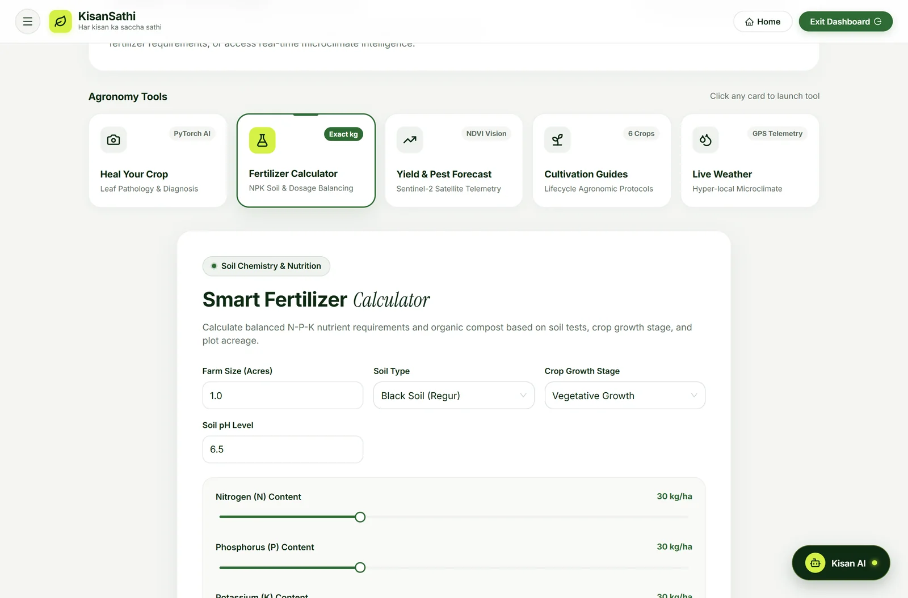

<br/><br/>

### Cultivation Lifecycle Protocols
*Structured stage-by-stage agronomic guides across major Indian crops.*
<br/>
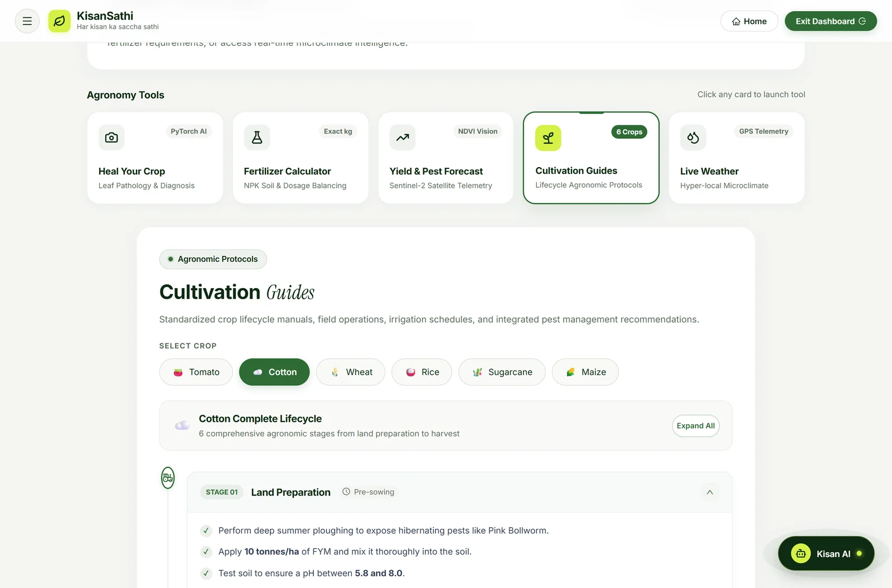

<br/><br/>

### Voice-Enabled Agronomy AI Assistant
*Floating assistant powered by Google Gemini with contextual agronomy intelligence and speech input.*
<br/>
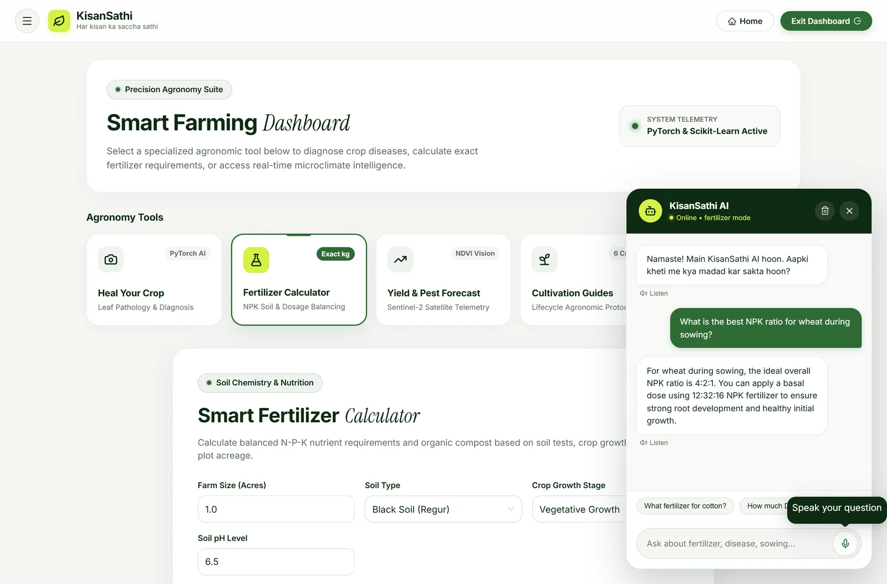

<br/><br/>

### Responsive Mobile Experience
*Complete responsive parity on mobile devices (390px viewport).*
<br/><br/>

<table>
  <tr>
    <td align="center"><b>Mobile Landing Experience</b></td>
    <td align="center"><b>Mobile Agronomy Dashboard</b></td>
  </tr>
  <tr>
    <td>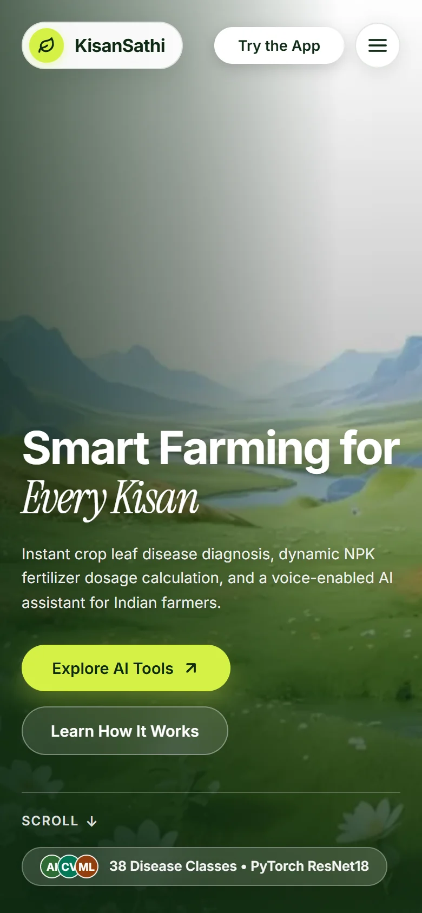</td>
    <td>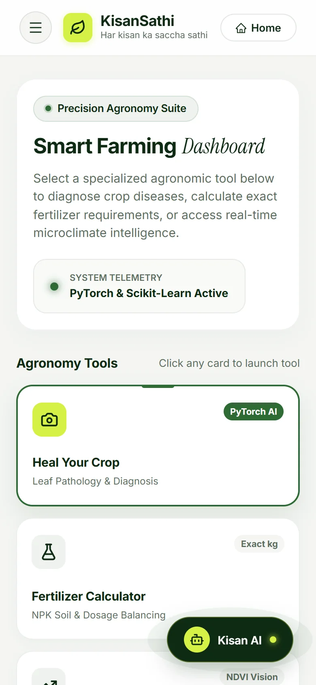</td>
  </tr>
</table>

</div>

---

## ✨ Features

| Feature | Description |
|---|---|
| 🩺 **Heal Your Crop (AI Diagnosis)** | Upload a photo of a diseased leaf. A PyTorch ResNet18 model analyzes the image, identifies the exact disease, and returns both chemical and organic treatment plans instantly. |
| 🧪 **Smart Fertilizer Calculator** | Input soil type, crop stage, farm size, and current NPK levels. A Scikit-Learn Random Forest model dynamically calculates exact kg dosage of Urea, DAP, MOP, and Organic Compost required. |
| 🛰️ **Yield & Pest Forecaster (PS-05)** | Correlates Copernicus Sentinel-2 satellite imagery (NDVI), root-zone soil telemetry, and predictive microclimate patterns to forecast localized crop harvest (Tons/Acre) and provide early-warning pest outbreak alerts with actionable IPM and irrigation guidance. |
| 🌾 **Cultivation Guides** | Step-by-step lifecycle guides for major crops (Tomato, Cotton, Wheat, etc.) covering sowing, irrigation, and pest control timelines. |
| 💬 **Floating AI Assistant** | A localized, context-aware chatbot powered by Google's Gemini 1.5 Pro — understands the page context and answers farming questions intelligently. |
| 🎨 **Ultra-Premium UI** | Modern agro-ecological glassmorphism interface built with Ant Design 6, featuring accessible contrast and smooth micro-animations. |
| 📱 **Responsive Design** | Fully responsive across desktop, tablet, and mobile viewports for use directly in the field. |

---

## 🛠️ Technology Stack

<table>
<tr>
<td valign="top" width="33%">

**Frontend**
- React 19 (Vite)
- Ant Design 6 & Custom CSS
- Framer Motion & Lucide React / Ant Design Icons
- Instrument Serif & Inter (Typography)

</td>
<td valign="top" width="33%">

**Backend**
- FastAPI (Python)
- Uvicorn (ASGI server)
- python-dotenv
- Pydantic (validation)

</td>
<td valign="top" width="33%">

**Machine Learning & AI**
- PyTorch + TorchVision (ResNet18)
- Scikit-Learn (Random Forest)
- Pandas + NumPy
- Google Gemini SDK (`gemini-1.5-pro-latest`)

</td>
</tr>
</table>

**Deployment:** Vercel (Frontend) · Render (Backend)

---

## ⚙️ System Architecture

<div align="center">
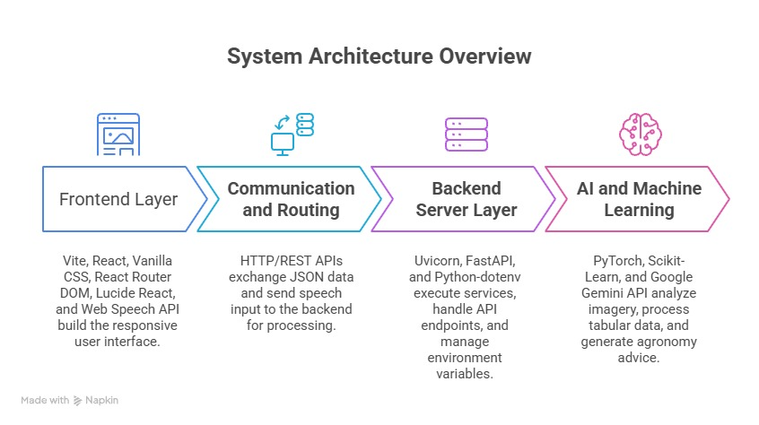
</div>

1. **Client Layer** — The React frontend captures user inputs (images, NPK slider values, chat messages) and sends them as `FormData` or JSON payloads via HTTP POST requests.
2. **API Layer** — FastAPI intercepts these requests on port `8000`. CORS is enabled to securely connect with the frontend.
3. **Inference Layer**
   - `/api/predict/disease` → passes the image to the loaded `.pth` PyTorch model.
   - `/api/predict/fertilizer` → formats JSON into a NumPy array, passed to the `.pkl` Scikit-Learn model.
   - `/api/chat` → securely connects to Google's Generative AI servers via API key, with automatic rate-limit fallbacks.
4. **Response Layer** — The backend returns structured JSON (confidence scores, exact fertilizer weights, or text responses), rendered instantly by the React UI without a page reload.

---

## 📁 Project Structure

```
kisan-sathi-new/
├── assets/
│   └── screenshots/          # README images
├── backend/
│   ├── main.py                # FastAPI entry point
│   ├── ml/
│   │   ├── train_disease_model.py
│   │   └── train_fertilizer_model.py
│   ├── models/                 # Trained .pth / .pkl files
│   ├── requirements.txt
│   └── .env                    # API keys (not committed)
├── frontend/
│   ├── src/
│   │   ├── components/
│   │   ├── pages/
│   │   └── App.jsx
│   ├── package.json
│   └── vite.config.js
├── .gitignore
└── README.md
```

---

## 🚀 Setup & Installation

### Prerequisites
* Node.js (v18+)
* Python (v3.9+)
* A Google Gemini API key ([Get one here](https://ai.google.dev/))

### 1. Clone the Repository
```bash
git clone https://github.com/madhavzanwar/kisan-sathi-new.git
cd kisan-sathi-new
```

### 2. Backend Setup
```powershell
cd backend
python -m venv venv

# Activate Virtual Environment (Windows)
.\venv\Scripts\activate

# Activate Virtual Environment (macOS/Linux)
source venv/bin/activate

# Install Dependencies
pip install fastapi uvicorn pydantic torch torchvision scikit-learn pandas numpy pillow python-dotenv google-generativeai
```

### 3. Train/Mock the ML Models
Generate the required `.pkl` and `.pth` model files for the backend to start:
```powershell
python ml/train_fertilizer_model.py
python ml/train_disease_model.py
```

### 4. Start the Backend
```powershell
uvicorn main:app --reload
```
Backend runs at `http://localhost:8000`

### 5. Frontend Setup
```powershell
cd frontend
npm install
npm run dev
```
Visit `http://localhost:5173` (or the port specified by Vite) to view the app.

---

## 🔐 Environment Variables

Create a `.env` file inside the `backend/` directory:

```env
GEMINI_API_KEY_1="your_first_gemini_api_key_here"
GEMINI_API_KEY_2="your_second_gemini_api_key_here"
GEMINI_MODEL="gemini-1.5-pro-latest"
```

> 💡 Two API keys are supported for automatic fallback if one hits a rate limit.

---

## 📡 API Endpoints

| Method | Endpoint | Description | Payload |
|---|---|---|---|
| `GET` | `/` | Root health check | — |
| `POST` | `/api/predict/disease` | Diagnose crop disease from a leaf image | `multipart/form-data` (image file) |
| `POST` | `/api/predict/fertilizer` | Calculate exact fertilizer dosage | `JSON` (n, p, k, ph, soil, crop, farm size) |
| `POST` | `/api/predict/yield-pest` | Predict localized crop yield & pest outbreak risks via satellite NDVI & weather | `JSON` (latitude, longitude, crop, sowing_date, farm_size_acres) |
| `POST` | `/api/chat` | Chat with the Gemini-powered AI assistant | `JSON` (message, context) |

**Example — Fertilizer Prediction Request:**
```json
POST /api/predict/fertilizer
{
  "nitrogen": 45,
  "phosphorus": 30,
  "potassium": 20,
  "ph": 6.5,
  "soil_type": "loamy",
  "crop": "wheat",
  "farm_size_acres": 2
}
```

**Example Response:**
```json
{
  "urea_kg": 12.5,
  "dap_kg": 8.2,
  "mop_kg": 5.0,
  "organic_compost_kg": 40.0,
  "confidence": 0.94
}
```

---

## 🧠 Machine Learning Models

| Model | Type | Purpose | Framework |
|---|---|---|---|
| **Disease Classifier** | CNN (ResNet18, transfer learning) | Classifies leaf images into disease categories | PyTorch / TorchVision |
| **Fertilizer Predictor** | Random Forest Regressor | Predicts optimal NPK + compost dosage from soil/crop inputs | Scikit-Learn |
| **Crop Yield Forecaster** | Random Forest Regressor (R² = 0.99) | Forecasts localized harvest yield from satellite NDVI, GDD & soil telemetry | Scikit-Learn |
| **Pest Risk Classifier** | Random Forest Classifier (95.7% Acc) | Evaluates multi-season environmental triggers for early outbreak warnings | Scikit-Learn |
| **AI Assistant** | Gemini 1.5 Pro (LLM) | Context-aware conversational farming guidance | Google Generative AI |

---


## 📄 License

This project is licensed under the **MIT License** — see the [LICENSE](./LICENSE) file for details.

---

<div align="center">

*Developed with a focus on modern design and scalable AI integration.*

**🌱 Empowering farmers, one prediction at a time.**

</div>
